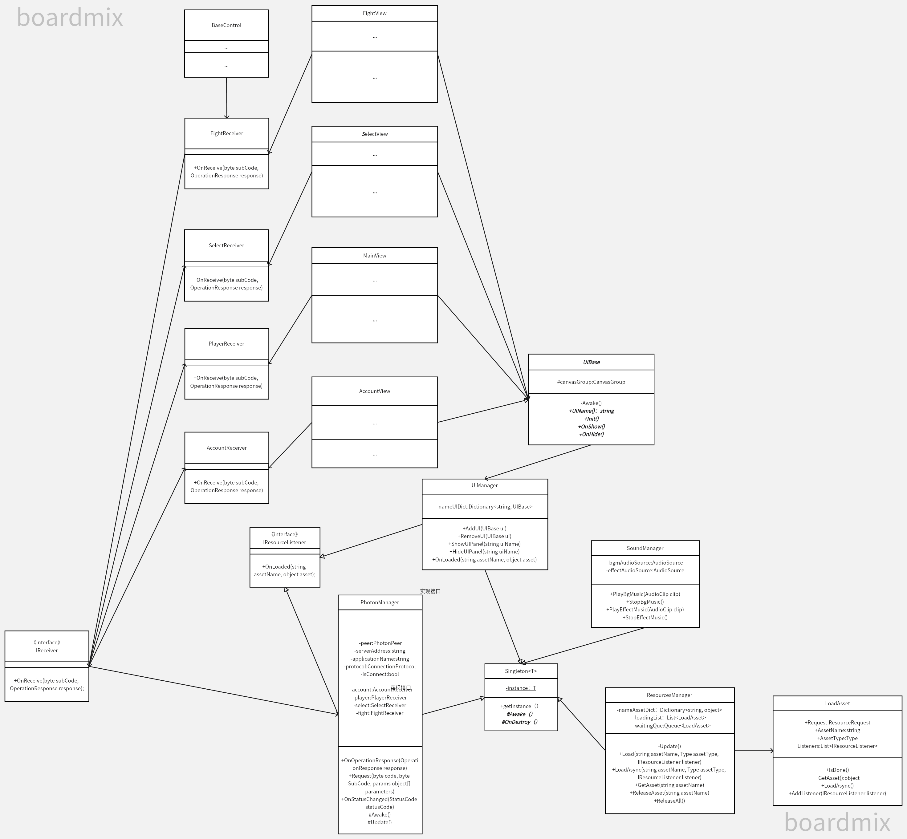
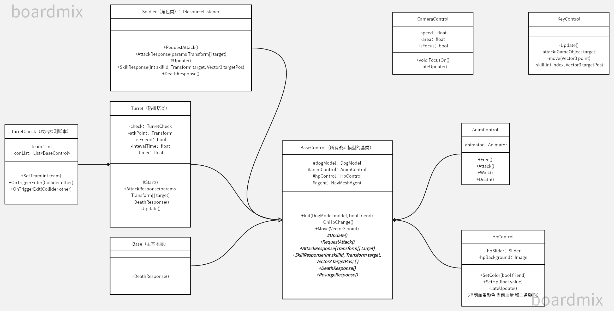

moba类游戏 对照类图来看 结构更清晰
1.首先服务器端采用Photon Sever
服务器收到从客户端发来的操作码以后，根据操作码，将任务分发给logic层的各个模块。
AccountHandler 负责用户的逻辑，例如登录 注册的验证等。
PlayerHandler 负责账号的逻辑，例如改名，添加好友等。
SelectHandler 负责选人逻辑，例如选取自己的角色，准备战斗。
FightHandler 负责战斗逻辑，例如移动，攻击等。
数据存储在cache层，业务逻辑层调用cache提供的接口进行业务处理。而cache层先从缓存中获取数据，若是没有获取到，则调用接口访问数据库，进行数据的增删改查。

2.客户端 采用U3D
MVC框架进行开发 将view和model 进行分离。
使用多个manager单例 对资源进行管理。例如UIManager,ResourcesManager,SoundManager等

战斗模块中BaseControl类是所有战斗模型的基类，游戏中所有能被攻击，能移动的对象的类都继承BaseControl

图片看不清的话 可以下载PDF文档.
